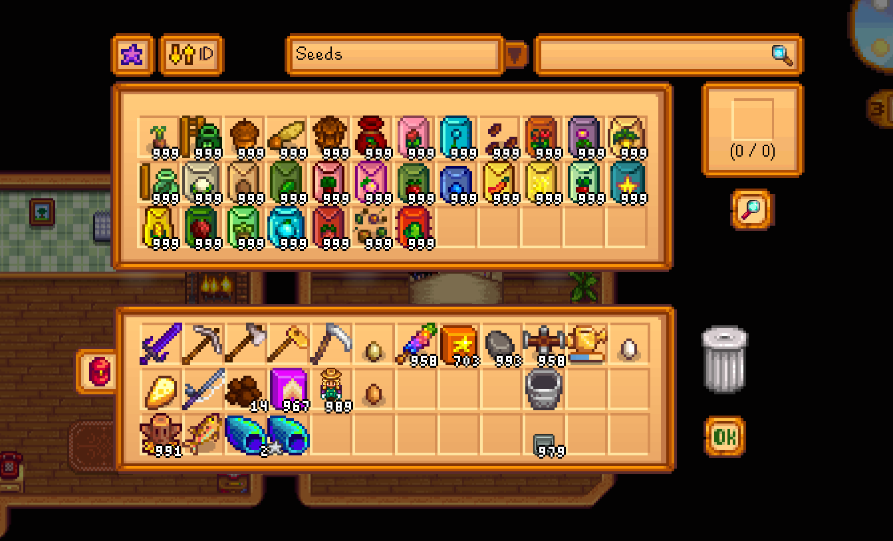

## Item Research 'n' Spawn

1. [Description](#description)
2. [Usage](#usage)
3. [Keys](#keys)
4. [Commands](#commands)
5. [Compatibility](#compatibility-at-present)
6. [Release notes](release-notes.md)

### Description:

**Item Research 'n' Spawn** is a Stardew Valley mod that lets give any item you want if you've researched it!

Want many of **\<item you want here>**?    
Collect some of them, put in research area, and click the button!    
Now you can have as much of **\<item you want here>** as you want :)



### Usage:
Press `R` on your keyboard (configurable) to open the menu.

In the menu you can...
+ Change item quality by clicking the quality button.
+ Change category filters by clicking the dropdown.
+ Scroll items with your mouse scroll wheel.
+ Search by pointing at the search box and typing an item name.
+ Research any item by placing it in research area and clicking the research button

Menu saves selected quality, category and search key

### Keys:
Quality button:   
`LMB` - next higher quality   
`RMB` - previous higher quality   

Sort option button:   
`LMB` - next option   
`RMB` - previous option

Category selector:   
`LMB` - open dropbox / select category    
`RMB` - close dropbox (without selection) / reset category   
`Scroll` - scroll categories / change category to next/previous   
`<Left/Right arrows>` - change category to next/previous

Searchbar:  
`LMB` - focus / blur    
`Hover` - focus / blur    
`RMB` - clear searchbar   
`ESC` - clear searchbar   

Research area:   
`LMB` - standard actions, like in chest / research    
`RMB` - standard actions, like in chest     
`Shift + LMB` - fast move an item to research area and back  

Other:   
`Scroll` - scroll cheat inventory   
`Up/Down arrows` - scroll cheat inventory   
`LMB` - move item to trash (only if researched) / drop items   
`Delete` - delete an item (only if researched)   
`Shift + LMB` - \*on trash can* delete all researched items

### Commands:
```
research_unlock_all //unlock all items (in-game only, menu must be opened at least once)   
research_unlock_active //unlock hotbar active item (in-game only, menu must be opened at least once)  
```

### Compatibility (at present):
+ Only windows supported (not tested on others)
+ Only keyboard + mouse (gamepad not tested)
+ **SMAPI 3.9.5** or later
