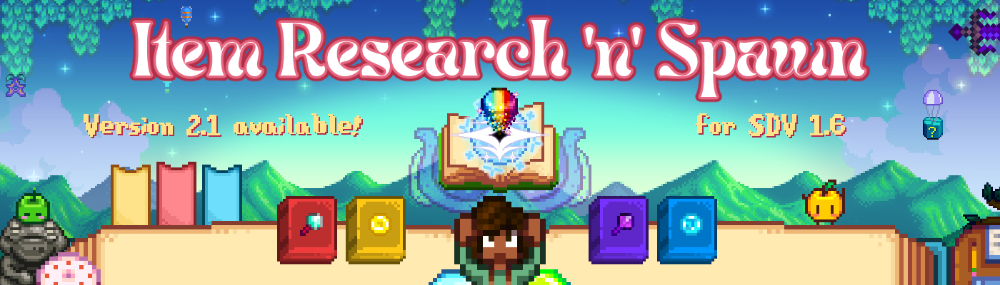

Hey-hey, a new update is here :)

## Description

This mod introduces mechanics similar to Terraria's Journey Mode and Minecraft's ProjectE mod, where you can "research" an item and create much more of it (for free or by spending some currency). There are different modes and settings available, allowing you to play the mod the way you like, either game-progression-friendly or straight-up cheaty ;)

## How to use

1. Press `R` (or your configured key) to open the menu.
2. Place items into the research area (a small animated hungry book).
3. Press the research button (under research area) until the item disappears from the research area.
4. Check the menu, if the amount of item was sufficient, the researched item will appear in the menu and leftovers will be returned to your inventory.

### Shortcuts

Press `left shift + lmb` to take full stack of item from menu.   
Press `left shift + rmb` to take half of a stack of item from menu.   
Press `left ctrl + rmb` to take `10` items from menu.   
Press `left alt + lmb` to mark/unmark the item as a favorite.   
Press `left ctrl + lmb` to quickly move items to the research area and back. If the item is researched, it will be sold or removed (bypassing the move to the research area).      
Press `left ctrl + lmb` on a trash can to remove all researched items from inventory (only for Research and Mr. Qi modes)        

## Install

1. [Install the latest version of SMAPI](https://smapi.io/).
2. Download the mod and unzip it into Stardew Valley/Mods/ directory.
3. You also need [Generic Mod Config Menu](https://www.nexusmods.com/stardewvalley/mods/5098) mod to be able to configure the mod.
4. Start the game using [SMAPI](https://stardewvalleywiki.com/Modding:Installing_SMAPI_on_Windows#Configure_your_game_client).

## Сompatibility
- **Stardew Valley 1.6** (*for SDV 1.5 use version 1.0.1*).
- **SMAPI 4.1.10** or later.
- **Windows**, *Linux*, *MacOS* (Linux and MacOS not tested, but should work ok)
- **Singleplayer** or **Multiplayer** (not split screen). For multiplayer, the mod must be installed by the host and optionally installed for other players (if they want to use the menu themselves).
- **Keyboard+Mouse only** (gamepad support will be added later, maybe......)
- Items added by other mods should work, but are not guaranteed. Besides that, there is no known mod conflict.

## Features

- 7 different modes to choose from:
	- Research mode - each item has own required amount for research, after research completion you can generate as much item you want for free.
	- Buy/Sell mode - you need only 1 of each item for research, giving items will cont in-game money and you can sell items as well. Also shows the money bar and tooltip for item price.
	- Combined mode - researching like in Research mode, after research completion like in Buy/Sell mode.
	- Mr. Qi mode - Research mode but all items already researched/unlocked. Basically **CJB Item Spawner** functionality.
	- JojaMart mode - Buy/Sell mode but all items already researched/unlocked. Items costs a lot, and sell price is 1. For true JojaMart fans. :)
    - Junimo's Magic Trade mode - Buy/Sell mode, but with it's own currency
    - JMT Combined mode - Combined mode, but with it's own currency

- Filtering:
    - Research progression tracking.
    - Favorite item filtering.
    - Item meta saving (colors, enchantments, etc...)

- Higly customizable:
    - Customizable buy and sell prices (using corresponding modifier).
    - Customizable research amount (using corresponding modifier).
    - Customizable categories, pricelist and item blacklist (using corresponding .json file in assets/config/ folder).
    - And much more!

## Modes

There are 7 modes (2 `Journey Mode`-like, 2 `ProjectE`-like, 2-`combined` ones, 1 for `JojaMart fans` and one `creative`). You can switch modes anytime you like, but they are more intended to be selected at the beginning of your playthrough and never changed later

**Try the new "JMT Combined mode" - it is the most game-friendly one!**

## Configuration

First of all, installing [Generic Mod Config Menu](https://www.nexusmods.com/stardewvalley/mods/5098) is mandatory, as this is the only way to change settings for the started save file. A config.json file is only for the default setting for new farms, do not change it manually!

Some commands are for host players only (in singleplayer you are the host) and will be synced for all non-host players

### Main

`Mod mode` - active mode (research mode, buy/sell mode, etc...) **\[Host only\]**     
`Open key` - keyboard key to open the menu     

### Multiplayer

`Commands for host only` - speaks for itself **\[Host only ;D\]**     

### Balancing

`Research amount multiplier` - increase/decrease amount of required research for all items **\[Host only\]**     
`Buy price multiplayer`- increase/decrease buy/spawn price for all items **\[Host only\]**          
`Sell price multiplayer`- increase/decrease sell price (to menu) for all items **\[Host only\]**    

### Misc

`Enable menu sounds` - speaks for itself     
`Show missing items` - to show each "Missing Item" in the menu if there are any     
`Research time` - determines how long you need to press the research button (in seconds) **\[Host only\]**   
`Automatic research` - for those who don't want to hold the button        
`Override UI color` - determines if a custom color should be used instead of the mode's default one       
`UI color (red, green, blue) value` - if you use the custom color, here you specify it as an `RGB` value (0-255)       

## Commands

There are special commands available. Since Chat Commands is outdated and Default On Cheats is not a replacement for it!; I made my own little system of chat commands. Works in both singleplayer and multiplayer. Each command must start with `!rns_`:
- `!rns_help` - prints all commands and their description
- `!rns_get_key` - prints active hotbar item "unique key". Can be used to tune price list and categories
- `!rns_unlock_active` - completes the research of active hotbar item
- `!rns_unlock_all` - completed the research of all items
- `!rns_dump_progression` - saves progression of all players in .json format. [Host only]
- `!rns_load_progression` - loads progressions back from .json files and replaces whatever is in the mod now. [Host only]
- `!rns_jmt_rich` - adds 10k to your jmt balance
- `!rns_jmt_broke` - voids your jmt balance